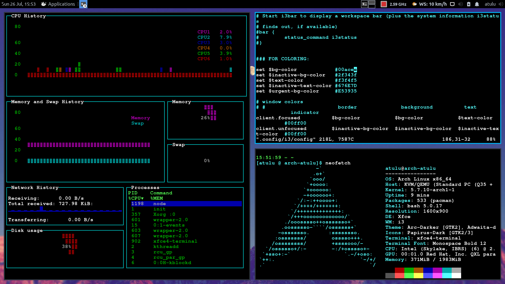
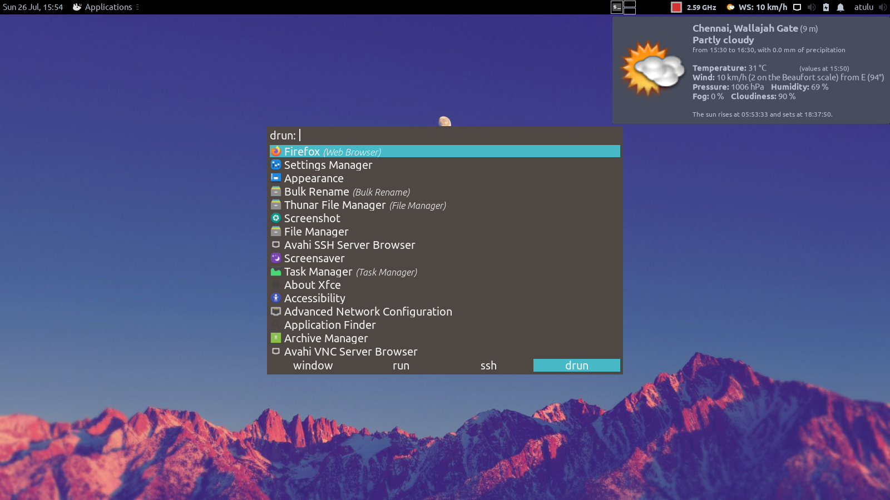

# Linux Dotfiles
A personal repo where I keep all my linux configuration files. This is meant to serve as a backup and easy access over all my installed distros for a quick configuration.

### Contents:
1. `xfce4-i3-config` - Contains the config file for `i3-gaps` WM I use in my Arch Linux with Xfce4.  
2. `PS1_value`: A bash prompt config value to my liking.
3. `.vimrc` : My config for `.vimrc`. I prefer using  4 tab indentation and shift values.

#### i3 config preview:
  
  

#### Power Management:
1. Set Intel Turbo Boost off to limit CPU speed to only 2.6GHz. Helps reduce temperature at heavy loads drastically (Doesn't cross more than 70 degrees). For this write a script named `turbo_boost_off.sh` with contents:
        
        #! /bin/bash  
        echo "1" | sudo /usr/bin/tee /sys/devices/system/cpu/intel_pstate/no_turbo
        
    Write a new sudo crontab entry by entering `sudo crontab -e` and writing: `@reboot /home/atulu/turbo_boost_off.sh`
    
2. Set Nvidia Prime profile to **On-Demand** as it has an average power consumption of only around 1 to 3W for simple apps usage compared to the 10 to 15W of Perfomance mode in idle usage.

3. In order to use an application, like say Virtual Box with the Nvidia Card then enter this in command line:
`__NV_PRIME_RENDER_OFFLOAD=1 __GLX_VENDOR_LIBRARY_NAME=nvidia virtualbox`

4. You can also set Application Profiles, but more research need to be done to use this settings.

5. Make sure to run `batCheck.sh` script by setting it in your `crontab` to monitor battery charge going above 60% or below 40%.

6. Ofcourse, use `tlp` and also `powertop`.
